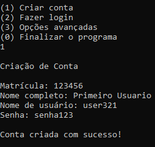
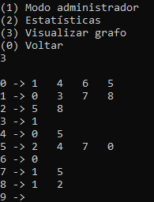

# Rede de Alunos

**Número da Lista**: 1<br>
**Conteúdo da Disciplina**: Grafos 1<br>

## Alunos
|Matrícula | Aluno |
| -- | -- |
| 18/0114077  |  Lucas Rodrigues Fonseca |
| 18/0113861  |  Kleidson Alves Corrêa |

## Sobre 
O projeto é uma rede de alunos. É possível criar uma conta ou fazer login com uma conta existente, adicionar ou remover amigos, entrar ou sair de grupos de alunos e alterar os dados cadastrados na conta. É possível também visualizar os dados e estatísticas do grafo formado. A sugestão de amigos é baseada em quantos amigos um usuário tem em comum com o usuário logado. Os grupos sugeridos permitem criar um grupo automaticamente com as pessoas sugeridas, que são escolhidas quando um ciclo de amizades é encontrado.

## Screenshots




## Instalação 
**Linguagem**: C++<br>
Para executar é preciso ter git, make e g++ instalados.<br>

### Comandos para instalar dependências:
```
sudo apt install git
sudo apt install make
sudo apt install g++
```
### Instruções para executar:
```
1. git clone https://github.com/projeto-de-algoritmos/Grafos1_Rede-Alunos
2. cd Grafos1_Rede-Alunos
3. make
4. make run
```

## Uso 
- Menu de login: a partir desse menu é possível criar um nova conta, fazer login com uma conta já existente ou acessar o menu avançado.
- Menu principal: a partir desse menu é possível acessar o menu de gerenciamento de amigos, grupos ou perfil.
- Menu de amigos: permite visualizar os amigos, adicionar e remover amigos ou ver amigos sugeridos.
- Menu de grupos: permite visualizar os grupos que o usuário faz parte, criar um grupo, entrar ou sair de um grupo já existente e visualizar grupos sugeridos.
- Menu de gerenciamento de perfil: permite alterar nome, nome de usuário, senha ou matrícula.
- Menu de opções avançadas: leva para o modo administrador, estatísticas do grafo ou visualização do grafo.
- Menu de administrador: permite conectar ou desconectar usuários utilizando o id do vértice no grafo ou nome de usuário, para facilitar os testes.
- Menu de estatísticas: mostra algumas estatísticas do grafo.
- Menu de visualizar grafo: mostra o atual estado do grafo.

## Outros 
O vídeo de explicação do programa está disponível na pasta raíz do repositório.
